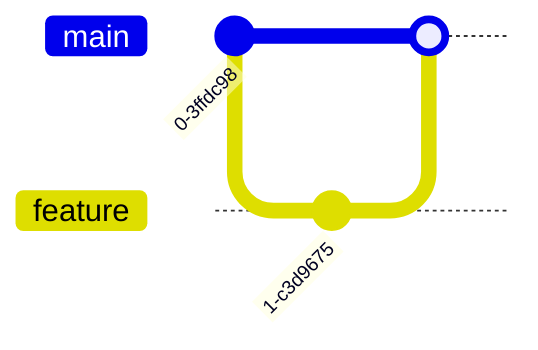

## Terminal Live Examples

Below are runnable terminal examples. Use fenced blocks with `terminal-input`.

### Basic playback

```terminal-input
echo "hello world"
_output_:
hello world
```

### Multiple commands and outputs

```terminal-input
pwd
_output_:
/home/user/project
ls -1
_output_:
README.md
src
package.json
```

### Command without output

```terminal-input
touch tmp.txt
```

### Separate multiple output sections

Add a new `_output_:` marker for each output segment.

```terminal-input
printf "line1\nline2"
_output_:
line1
line2

echo done
_output_:
done
```

### Custom prompt per block

Use raw HTML to set a custom prompt via `data-prompt`.

<pre data-prompt="#"><code class="language-terminal-input">whoami
_output_:
root
</code></pre>

Tip: set a global prompt with `window.terminalLiveConfig = { prompt: ">" }` before the terminal script loads.

### Multiple terminal blocks on a page

```terminal-input
echo one
_output_:
one
```

```terminal-input
echo two
_output_:
two
```

---

## Diagram Examples (Mermaid)

Use fenced blocks with `mermaid` (or `diag`).

### Flowchart (TD)


### Flowchart (LR)


### Sequence Diagram


### Class Diagram


### State Diagram


### ER Diagram


### User Journey


### Gantt


### Pie Chart


### Mindmap


### Timeline


### Requirement Diagram


### Git Graph



